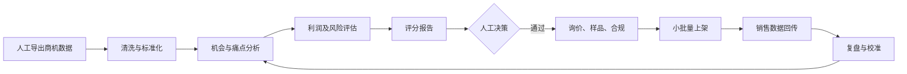

# 亚马逊 AI 选品实验室执行方案

## 目标

用美国站真实数据，在 90 天内跑通机会发现、人工决策、小批量上架和销售复盘闭环。先依靠自营商品盈利，再考虑产品化。

## 边界

- 首期预算 2 万至 5 万元人民币。
- 同时测试不超过 3 款，每款小批量采购。
- 优先售价 20 至 50 美元、轻小件、非季节性、低认证门槛商品。
- 商机探测器数据先人工导出，不依赖后台网页爬虫。
- 暂不自动采购、上架、调价或投放广告。

## 90 天成功标准

- 建立至少 100 个细分市场候选库。
- 人工复核至少 30 个机会。
- 打样 5 至 10 个候选，小批量上架 2 至 3 款。
- 每个推荐都能追溯到数据、评分和否决理由。
- 上线 60 至 90 天后评估贡献利润、自然订单、周转、退货和风险。

至少累计 10 个真实商品实验后，才比较 Agent 与人工选品成功率。

## 评分模型

| 维度 | 权重 |
|---|---:|
| 需求强度与增长 | 20 |
| 竞争可进入性 | 20 |
| 痛点与差异化 | 20 |
| 单位经济性 | 20 |
| 供应链可执行性 | 10 |
| 运营可获取性 | 10 |

风险红线优先：高侵权、高合规风险、危险品或基准贡献利润率低于 15% 时拒绝。

## 两级机会漏斗

1. 细分市场级：使用搜索量、增长、点击商品广度、价格和退货率筛选赛道。
2. ASIN 产品级：使用点击量、BSR、评价壁垒、低评分信号和价格稳定性寻找参考商品。
3. 产品方案级：人工组合差异化方向并补齐成本、物流、广告和风险数据后计算利润。

市场分数和 ASIN 分数都不直接触发采购；只有产品方案通过利润红线和人工审核后才能进入打样。

## Agent 工作流

## 阶段计划

### 第 1 至 2 周

- 导入 20 至 30 个商机探测器细分市场。
- 为优先细分市场导入 ASIN Explorer 数据，建立产品机会榜。
- 建立字段字典、利润公式和风险红线。
- 用 3 个历史商品盲测。

### 第 3 至 4 周

- 完成评论及退货痛点聚类。
- 生成 Top 10 候选和一页式报告。
- 记录全部人工通过与否决理由。

### 第 5 至 6 周

- 对 Top 10 询价。
- 购买 5 至 10 个样品。
- 完成商标、专利、认证和正式利润复算。

### 第 7 至 9 周

- 小批量上架 2 至 3 款。
- 为每款设置预算、观察期、补货线和止损线。
- 分开记录自然流量与广告流量。

### 第 10 至 12 周

- 对比预测与真实需求、转化、CPC、利润和退货。
- 区分选品错误与 Listing、价格、广告执行错误。
- 按批次调整规则，避免根据单品过拟合。

## 第一周只做四件事

1. 导出 20 至 30 个美国站细分市场。
2. 建立统一字段模板。
3. 用真实费用运行三情景利润模型。
4. 用 3 个历史商品校准评分。

在此之前，不开发复杂多 Agent 编排和运营自动化。
